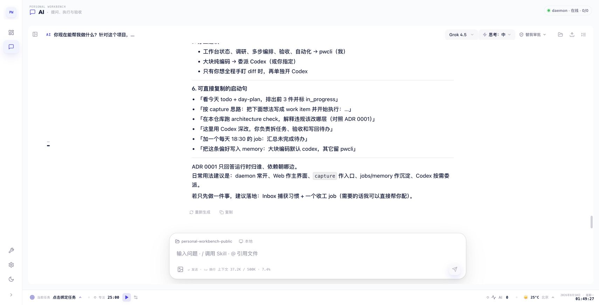

# Personal Workbench

> A local-first AI workbench that combines a browser workspace, an interactive
> terminal, and a durable agent runtime in one Rust executable.

[](https://www.npmjs.com/package/@liki030814/pwcli)
[](https://github.com/liki-0814/personal-workbench-public/actions/workflows/ci.yml)
[](LICENSE)
[](#installation)

Personal Workbench turns conversations into ongoing work. Chat with different
model providers, let agents use tools, keep long-running work alive in the
background, and manage tasks, goals, jobs, habits, documents, and generated
artifacts from the same local application.



## Why Personal Workbench

AI coding tools are excellent at answering a prompt, but real work rarely fits
inside one prompt. It spans repositories, tools, approvals, retries, background
jobs, documents, and decisions that must survive after a browser tab closes.

Personal Workbench exists to make that work **local, durable, and inspectable**:

- keep the workspace and runtime on your machine instead of moving the whole
  workflow into a hosted black box;
- turn conversations into resumable sessions and background tasks rather than
  disposable chat transcripts;
- show model reasoning events, tool activity, permission requests, artifacts,
  and final answers in one reviewable timeline;
- use different model providers through one consistent runtime without tying
  the product to a single API;
- ship the browser UI and agent backend together, so installation and upgrades
  stay close to a normal command-line tool.

The result is a personal control plane for AI-assisted work: approachable from
the browser, scriptable from the terminal, and explicit about what runs locally
and what can change your files. See [PWCLI design and architecture](docs/PWCLI_DESIGN_AND_ARCHITECTURE.md)
for the engineering decisions behind it.

## Quick start

The prebuilt npm release currently supports **macOS on Apple Silicon** and
requires Node.js 18 or newer:

```bash
npm install --global @liki030814/pwcli --registry=https://registry.npmjs.org/
pwcli config
pwcli web
```

`pwcli config` opens the provider setup. `pwcli web` starts the local daemon and
opens the browser workbench at `http://127.0.0.1:3456`.

Prefer the terminal? Run `pwcli` without a subcommand for the interactive TUI:

```bash
pwcli
```

## What you can do

| Area | What Personal Workbench provides |
| --- | --- |
| AI conversations | Streamed reasoning, tool activity, review decisions, final answers, and answer-version history in one ordered timeline. |
| Model control | Model-aware thinking levels, provider-specific capabilities, and runtime reasoning updates. |
| Durable agent work | Background tasks, delegated sessions, progress events, decision requests, retries, and continuation without starting over. |
| Personal planning | Todos, goals and key results, day plans, habits, streaks, history heatmaps, pomodoro, and an inbox for captured work. |
| Scheduled jobs | Guided or AI-assisted job creation, execution history, logs, testing, and controlled activation. |
| Documents and artifacts | Local document workflows, file tools, images, PDFs, scientific illustrations, and reviewable outputs. |
| Local operation | One daemon owns the agent runtime, HTTP/SSE API, local data, and the embedded production web UI. |

## Typical workflows

### Ask once from a script

```bash
pwcli -p "Review this repository and list the three highest-risk changes"
```

Standard input can be included in a one-shot request:

```bash
git diff | pwcli -p "Summarize this diff and call out compatibility risks"
```

### Keep the daemon running

```bash
pwcli daemon start
pwcli daemon status
pwcli daemon stop
```

### Diagnose local setup

```bash
pwcli doctor
```

### Generate a scientific illustration

```bash
pwcli illustrate --intent "A clean data-flow diagram for a retrieval pipeline"
```

Run `pwcli --help` or `pwcli <command> --help` for the complete CLI reference.

## Model providers

Personal Workbench includes first-class provider definitions and also supports
custom endpoints.

| Built-in provider | Authentication/configuration path |
| --- | --- |
| OpenAI Codex | Browser or device login |
| Google Antigravity | Browser OAuth login |
| Kimi Coding | Device login or API configuration |
| Grok / xAI | Device login or `XAI_API_KEY` |
| Qwen Token Plan CN | API-key configuration |
| Custom provider | OpenAI-, Anthropic-, or Google-compatible endpoint settings |

Provider and model settings are explicit: protocol, proxy use, model
capabilities, request parameters, thinking parameters, deferred tools, output
limits, and context limits are stored as configuration rather than inferred
from provider names.

## Local data and security

- Configuration and runtime data are stored under `~/.pwcli/`.
- The daemon listens on loopback by default at `127.0.0.1:3456`.
- OAuth access and refresh tokens are handled by the Rust daemon and are not
  returned to the browser UI.
- Mutating and external tools pass through the runtime's permission and review
  policies; background work remains tied to its owning session.
- This project can execute commands and edit files. Review the selected
  workspace, provider permissions, and generated actions before approving
  consequential operations.

## Installation

### npm binary — macOS Apple Silicon

```bash
npm install --global @liki030814/pwcli --registry=https://registry.npmjs.org/
pwcli --version
```

The small launcher package installs the matching native package
`pwcli-darwin-arm64`. Other platforms should currently build from source.
Using the official registry explicitly avoids `ETARGET` errors from npm mirrors
that have not synchronized the latest release yet.

### Upgrade an existing installation

Starting with `0.1.2`, the launcher can update the native package and restart a
running daemon without changing local configuration or session data:

```bash
pwcli upgrade
```

Users upgrading from `0.1.1` need this one-time bootstrap because that launcher
did not yet include the upgrade command:

```bash
npm install --global @liki030814/pwcli@latest --registry=https://registry.npmjs.org/
pwcli daemon restart
```

### Build from source

Requirements:

- Node.js 18 or newer and npm
- A current Rust toolchain with Cargo

Clone and run the setup script:

```bash
git clone https://github.com/liki-0814/personal-workbench-public.git
cd personal-workbench-public
./setup.sh
```

Or build each target explicitly:

```bash
npm install
npm run build
npm run build:pwcli:release
./pwcli/target/release/pwcli web
```

## Development

Install dependencies:

```bash
npm install
```

Run the daemon and Vite frontend in separate terminals:

```bash
cargo run --manifest-path pwcli/Cargo.toml -- daemon run
```

```bash
npm run dev
```

Vite runs at `http://127.0.0.1:5173` and proxies `/api` to the daemon.

### Verification

```bash
npm run check:architecture
npm run lint
npm test
npm run build
cargo fmt --manifest-path pwcli/Cargo.toml -- --check
cargo test --manifest-path pwcli/Cargo.toml
```

## Architecture

Personal Workbench has two build targets but ships as one product:

```text
Browser / TUI / CLI / internal worker
                  │
                  ▼
        application and service boundary
                  │
                  ▼
        RuntimeFactory → AgentRuntime
                  │
        ┌─────────┴─────────┐
        ▼                   ▼
    agent core       provider/tool adapters
        │
        ▼
 SessionManager / TaskBroker / local storage
```

The React production build is embedded into the Rust executable. The daemon
owns cross-turn state and background work; an `AgentRuntime` owns one model/tool
turn. The agent core depends on transport-neutral contracts and tool ports, not
on the web service or durable task broker.

<details>
<summary>Repository map</summary>

| Path | Responsibility |
| --- | --- |
| `src/core/` | Frontend configuration, storage, LLM clients, and shared infrastructure. |
| `src/domain/` | Chat, todo, documents, jobs, habits, pomodoro, and other product domains. |
| `src/features/` | Cross-domain workflows such as the workbench and settings. |
| `src/shell/` | Application chrome and reusable presentation primitives. |
| `pwcli/src/agent_core/` | Transport-neutral agent contracts, graph, harness, middleware, and reliability policy. |
| `pwcli/src/ai/` | Provider catalog, authentication, protocol adapters, and usage accounting. |
| `pwcli/src/runtime/` | Durable sessions, tasks, tools, permissions, memory, and artifacts. |
| `pwcli/src/app/` | CLI, composition, daemon, HTTP/SSE service, and web routes. |
| `config/` | Vite, Vitest, ESLint, Tailwind, TypeScript, and architecture rules. |
| `docs/adr/` | Architecture decisions and dependency constraints. |

See [PWCLI design and architecture](docs/PWCLI_DESIGN_AND_ARCHITECTURE.md)
for the full ownership model, request lifecycle, and design tradeoffs.

</details>

## Publishing the npm binary

Maintainers can build and inspect the packages without publishing them:

```bash
npm run build
npm run build:pwcli:release
npm run package:pwcli:npm
```

This produces ignored tarballs under `npm/dist/`:

- `pwcli-darwin-arm64-<version>.tgz` — the native Apple Silicon binary.
- `liki030814-pwcli-<version>.tgz` — the scoped launcher users install.

Publish the platform package first, then the launcher:

```bash
npm publish ./npm/dist/pwcli-darwin-arm64-0.2.0.tgz --access public
npm publish ./npm/dist/liki030814-pwcli-0.2.0.tgz --access public
```

## License

Personal Workbench is licensed under the [GNU AGPL v3](LICENSE). Third-party
components and notices are listed in [THIRD_PARTY_NOTICES.md](THIRD_PARTY_NOTICES.md).
