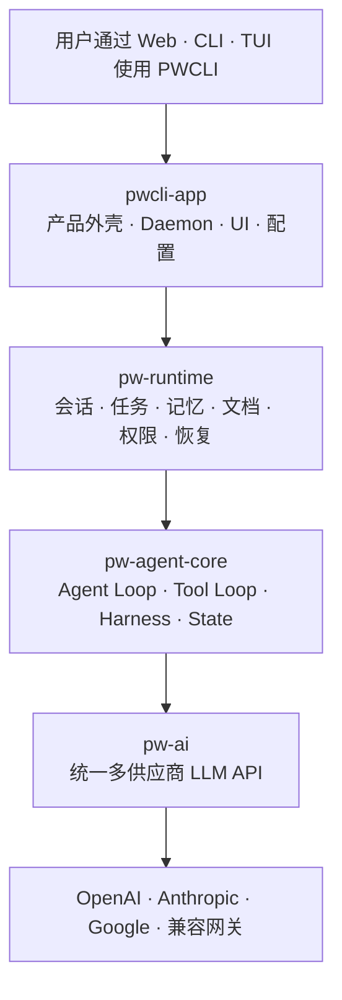

# PWCLI 四层架构改造计划

> 状态：Draft  
> 目标架构：`pwcli-app → pw-runtime → pw-agent-core → pw-ai`  
> 原则：先建立逻辑边界，再拆分 Cargo crate；保持现有功能、配置和数据兼容。

## 1. 背景

PWCLI 已从单一 CLI Agent 发展为包含 Web、Daemon、持久会话、多智能体任务、记忆、文档、权限、审查和恢复能力的本地 Agent 平台。但后端能力仍集中在一个 Rust crate 中，多个模块同时承担运行时职责：

- `agent_runner`、`graph`、`harness`、`middleware` 都参与一次 Agent Turn 的编排。
- `session`、`service::session_manager`、`task`、`background` 分别管理不同层次的持久运行状态。
- `tools`、`task`、`permissions`、`service` 之间存在反向或横向依赖。
- Web、CLI、主 Agent 和 delegated worker 分别装配 LLM、工具、权限、Harness 与 Middleware，存在行为漂移风险。
- `task/mod.rs`、`service/routes.rs`、`graph/executor.rs` 等文件同时承担多个变化原因。

本次改造不以“增加更多目录或 crate”为目标，而是建立一条任何开发者都能一眼理解的依赖主链。

## 2. 对外四层架构



四层分别回答四个问题：

| 层 | 核心问题 | 主要职责 |
|---|---|---|
| `pwcli-app` | 用户怎样使用 PWCLI？ | Web、CLI、TUI、Daemon API、配置、启动、装配、事件投影 |
| `pw-runtime` | 工作怎样持续存在？ | Session、Work Item、Task、Memory、Document、Permission、Outbox、Attention、恢复 |
| `pw-agent-core` | 一次 Agent Turn 怎样执行？ | Agent 状态机、模型循环、工具循环、Middleware、Harness、流事件 |
| `pw-ai` | 怎样统一访问模型？ | Provider、Model、协议 Adapter、stream、thinking、tool call、vision、usage、fallback |

`contracts`、ports、SQLite、Git、文件系统和 Provider SDK 是保证四层单向依赖的内部结构，不作为顶层产品模块展示。

## 3. 目标依赖规则

1. `pwcli-app` 可以依赖所有下层模块，是唯一组合根。
2. `pw-runtime` 可以调用 `pw-agent-core`，但 Core 不得反向调用 Runtime。
3. `pw-agent-core` 通过端口调用模型和工具，不读取全局配置或具体存储。
4. `pw-ai` 不依赖 Session、Task、Daemon、BackendClient 或前端 DTO。
5. HTTP、SQLite、Git、文件系统和外部进程属于 Adapter，不进入 Agent Core。
6. React、CLI 和 TUI 只消费稳定事件或 API schema，不读取 Rust 内部领域结构。
7. 依赖规则必须由 Cargo、可见性和架构测试强制，不能只依赖约定。

## 4. 当前模块归属

| 当前模块 | 目标层 | 改造说明 |
|---|---|---|
| `app`、`service`、`daemon`、`commands`、`tui_*` | `pwcli-app` | 收敛为入口、Transport 和唯一组合根 |
| `session`、`task`、`background`、`memory`、`documents`、`permissions`、`reliability` | `pw-runtime` | 区分领域、Store、Scheduler、Projection 和 Adapter |
| `agent_runner`、`graph`、`harness`、`middleware`、`hooks` | `pw-agent-core` | 收敛为唯一 AgentKernel |
| `llm` | `pw-ai` | 保留协议 Adapter，移除产品配置和 Backend 依赖 |
| `tools::registry`、工具契约 | `pw-agent-core` 内部契约 | Core 只知道抽象工具 |
| 具体文件、Web、SSH、PDF、Memory、Task 工具 | Runtime/App Adapter | 通过 `ToolExecutionContext` 注入 |
| `fusion` | `pw-agent-core` 的可选 DecisionPolicy | 不作为一级模块 |
| `config`、`git`、`media`、SQLite、HTTP client | App/Runtime Adapter | 不进入 Core |
| `skills`、trusted extensions | App 资源加载与 Runtime 工具装配 | 统一扩展契约后注入 Core |

## 5. 非目标

本轮改造明确不做：

- 不一次性重写 Agent Runtime。
- 不同时更换 Session、Task 或 Memory 的数据库 Schema。
- 不为了目录对称创建大量空 crate。
- 不删除现有权限、任务恢复、Worktree 审查、记忆或文档能力。
- 不强制改变前端交互和现有配置格式。
- 不把所有共享代码放入新的 `common` 或 `utils` 大杂烩。
- 不在新旧执行路径之间长期双写。

## 6. 总体实施策略

采用渐进式迁移：

```text
建立新契约 → 旧实现适配新接口 → 入口切换 → 回归验证 → 删除旧路径
```

在逻辑边界稳定之前，优先保留单 crate。只有模块能够独立构建和测试后，才移动到独立 Cargo crate。

## 7. Phase 0：基线与架构约束

### 7.1 目标

固定当前行为，为后续结构调整提供回归依据。

### 7.2 工作项

- 新增架构 ADR，定义四层职责、依赖方向和统一术语。
- 记录当前模块依赖图和已知反向依赖。
- 为以下入口建立运行配置快照：
  - Web 主会话
  - CLI oneshot
  - 内部 delegated worker
  - ACP external worker
- 快照内容至少包括：
  - 可用工具集合
  - Middleware 顺序
  - Harness profile
  - 权限模式
  - Provider/Model 解析结果
  - Memory 注入模式
  - Fusion reviewer 状态
- 记录 Release 二进制体积、启动时间和关键测试耗时。
- 增加第一版架构依赖检查。

### 7.3 验收门禁

- 当前 Rust 与前端测试全部通过。
- 四类入口的能力快照稳定。
- CI 能发现新增的 Core → Service 或 Core → Storage 依赖。
- 本阶段不改变运行行为。

## 8. Phase 1：建立内部 contracts

### 8.1 目标

让基础类型不再从具体实现模块中反向获取。

### 8.2 初始目录

先在现有 crate 内建立：

```text
pwcli/src/contracts/
├── message.rs
├── model.rs
├── tool.rs
├── event.rs
├── failure.rs
├── permission.rs
├── artifact.rs
├── ids.rs
└── ports.rs
```

### 8.3 迁入内容

- Message、ContentBlock、ToolCall、ToolResult
- ModelRequest、ModelResponse、StreamEvent、Usage
- ToolSchema、ToolImpact、ToolExecutionMode
- FailureEnvelope、RecoveryAction
- PermissionRequest、PermissionDecision
- ArtifactRef、DocumentRef
- SessionId、TaskId、AttemptId、WorkItemId
- `ModelPort`、`ToolExecutorPort`、`ArtifactStore`、`SessionStore` 等接口

### 8.4 优先消除的依赖

- `permissions → agent_runner`
- `permissions → tools`
- `graph → agent_runner`
- `harness → graph` 中仅为获取基础类型的引用
- `service` 与前端 DTO 直接复用内部可变结构

### 8.5 验收门禁

- `contracts` 不依赖 Axum、SQLite、Git、文件系统或具体 Provider。
- 类型迁移不改变序列化兼容性。
- 历史 Session、Task 与配置仍可读取。
- 现有测试通过，新增契约序列化测试。

## 9. Phase 2：统一 RuntimeFactory

### 9.1 目标

消除 Web、CLI、主 Agent 和 Worker 的重复装配。

### 9.2 建议接口

```rust
pub enum RuntimeProfile {
    WebMain,
    CliOneshot,
    InternalWorker,
    ExternalWorker,
    Test,
}

pub struct RuntimeFactory { /* adapters and configuration */ }

impl RuntimeFactory {
    pub async fn create(&self, profile: RuntimeProfile) -> Result<AgentRuntime>;
}
```

### 9.3 统一装配内容

- LLM/ModelPort
- ToolRegistry
- Permission/PolicyEvaluator
- Harness
- Middleware chain
- Memory injection
- Artifact store
- Decision reviewer
- Progress/Event sink
- Cancellation
- Session/Task context

### 9.4 迁移入口

1. CLI oneshot
2. delegated worker
3. Web 主会话
4. continuation/recovery
5. ACP external worker

### 9.5 验收门禁

- 所有入口通过 `RuntimeFactory` 创建 Agent Runtime。
- 相同 profile 的工具、Middleware 和权限配置具有快照测试。
- 删除入口中的重复 ToolRegistry/AgentRunner 手工构造。
- Web、CLI 和 Worker 的现有功能保持一致。

## 10. Phase 3：收敛 pw-agent-core

### 10.1 目标

形成一次 Agent Turn 的唯一 owner。

### 10.2 目标模型

```text
AgentKernel
├── AgentState
├── TurnLoop
├── ModelPort
├── ToolLoop
├── MiddlewarePipeline
├── HarnessControl
└── AgentEventStream
```

### 10.3 当前模块处理

- `agent_runner`：收敛为 `AgentKernel` 的外部入口。
- `graph`：保留内部状态机，不再成为第二套公开运行时。
- `harness`：负责 Turn 控制、队列和领域事件。
- `middleware`：负责显式的扩展管线。
- `hooks`：合并到统一扩展生命周期，避免两套 Hook。
- `fusion`：实现可选 `DecisionPolicy`，由 Core 注入。

### 10.4 Core 禁止依赖

- Axum 与 HTTP route
- SQLite、文件 Journal
- TaskBroker、Worktree
- WebFetchCache
- BackendClient
- React/CLI/TUI DTO
- 全局配置文件

### 10.5 验收门禁

- 使用 Fake Model 和 Fake Tool 可以在内存中完成完整 Turn。
- 覆盖 text、thinking、tool call、abort、steer、follow-up 和 retry 测试。
- `AgentRunner` 与 `Graph` 不再包含两套重复编排逻辑。
- Core 只产出领域事件，不直接渲染 SSE 或终端文本。

## 11. Phase 4：抽出 pw-ai

### 11.1 目标

让模型层可以脱离 Daemon 和产品配置独立使用。

### 11.2 包含内容

- Provider、Model、ModelCapabilities
- `openai_chat`
- `openai_responses`
- `anthropic_messages`
- `google_generative`
- 统一 Message/Tool/StreamEvent
- thinking、vision、usage
- retry 与安全 fallback
- request/thinking 参数合并

### 11.3 必须移除

- 直接读取 RuntimeConfig
- 直接调用 BackendClient
- URL、供应商名、模型 ID 暗规则
- 对 Daemon proxy route 的具体依赖

### 11.4 验收门禁

- 使用内存 Provider 配置即可发起调用。
- 四种协议拥有独立契约测试。
- 同协议不同 base URL 行为一致。
- `pw-ai` 可以单独构建和运行测试。

## 12. Phase 5：整理 pw-runtime

### 12.1 目标

统一承载跨 Turn、跨进程和跨 Agent 的持久语义。

### 12.2 Task 拆分

```text
runtime/task/
├── domain.rs
├── store.rs
├── scheduler.rs
├── worker.rs
├── delivery.rs
├── recovery.rs
└── review.rs
```

- `domain`：Batch、Task、Attempt、状态迁移和业务规则。
- `store`：SQLite 持久化与事务。
- `scheduler`：并发、lease、heartbeat 和 ready queue。
- `worker`：内部 Worker 与 ACP executor 启动。
- `delivery`：Artifact materialization、Outbox 和 callback。
- `recovery`：重启、孤立 Attempt、callback spool。
- `review`：Worktree、patch、apply、reject、merge-required。

### 12.3 Session 拆分

```text
runtime/session/
├── domain.rs
├── journal.rs
├── store.rs
├── live_runtime.rs
└── projection.rs
```

- `domain`：Session、generation、branch 和 queued input。
- `journal`：追加式事件与重建。
- `store`：持久化接口。
- `live_runtime`：活动会话、输入 actor 和 continuation。
- `projection`：面向 Web/TUI/CLI 的读取模型。

### 12.4 其他 Runtime 子域

- MemoryService
- DocumentService
- ArtifactService
- PermissionService
- AttentionService
- RecoveryCoordinator

### 12.5 验收门禁

- Domain 状态机不直接执行 SQLite。
- Store 不包含 HTTP 或 UI 决策。
- Scheduler 不直接发送 SSE。
- Agent Core 通过端口发布任务或写入 Artifact。
- 数据库 Schema 与历史数据保持兼容。

## 13. Phase 6：ToolExecutionContext 与 Adapter 化

### 13.1 目标

消除工具层的隐式全局状态和对 Service 的反向依赖。

### 13.2 建议接口

```rust
pub struct ToolExecutionContext {
    pub session_id: Option<SessionId>,
    pub work_item_id: Option<WorkItemId>,
    pub task_id: Option<TaskId>,
    pub cwd: PathBuf,
    pub permissions: Arc<dyn PermissionPort>,
    pub artifacts: Arc<dyn ArtifactStore>,
    pub progress: Arc<dyn ProgressSink>,
    pub cancellation: CancellationToken,
}
```

### 13.3 替换目标

- `tools::web_context`
- 隐式 task-local session/work-item/image registry
- `dispatch_tasks → service::session_manager`
- Tool 直接读取全局 RuntimeConfig
- Tool 直接投影 SSE 或前端状态

### 13.4 验收门禁

- `tools` 不再依赖 `service`。
- Tool 单测可以构造最小 Context。
- 主会话、后台工具和 Worker 使用同一 Tool 契约。
- Tool 结果只返回结构化输出和领域事件。

## 14. Phase 7：Cargo workspace 物理拆分

逻辑边界稳定后，建立：

```text
crates/
├── pw-contracts/
├── pw-ai/
├── pw-agent-core/
└── pw-runtime/

apps/
└── pwcli/
```

对外仍只展示四层架构；`pw-contracts` 是内部依赖基础，不是第五个产品模块。

### 14.1 验收门禁

- Cargo 依赖图无环。
- `pw-agent-core` 不依赖 Axum、rusqlite、Git 或 UI 库。
- `pw-ai`、`pw-agent-core` 可以独立构建和测试。
- `pwcli` 二进制行为、配置和数据兼容。
- 前端仍通过稳定 API/Event schema 工作。

## 15. 推荐第一轮实施范围

第一轮只实施以下内容：

1. 架构 ADR、术语表和依赖测试。
2. 内部 `contracts` 模块。
3. `RuntimeFactory` 与入口能力快照。
4. `ToolExecutionContext` 接口设计和一到两个试点工具。
5. 按职责拆分 `task/mod.rs`，暂不更改数据库 Schema。

第一轮不创建 Cargo workspace，不移动所有模块，不重写 Session 或 Task。

## 16. 第一轮建议任务拆分

| 编号 | 任务 | 前置 | 风险 | 完成标志 |
|---|---|---|---|---|
| A1 | 编写 ADR 与术语表 | 无 | 低 | 四层职责和禁止依赖明确 |
| A2 | 建立入口能力快照 | A1 | 低 | 四种 profile 有稳定快照 |
| A3 | 新建 contracts 并迁移 ID/Failure | A1 | 中 | 无行为变化，序列化兼容 |
| A4 | 迁移 Message/Tool/Event 契约 | A3 | 中 | Core 基础类型不来自具体实现 |
| A5 | 设计 RuntimeFactory | A2、A4 | 中 | Profile 与依赖注入接口确定 |
| A6 | 切换 CLI oneshot | A5 | 中 | CLI 回归通过 |
| A7 | 切换 delegated worker | A6 | 中 | Worker 回归通过 |
| A8 | 切换 Web 主会话 | A7 | 高 | SSE、权限、工具、恢复通过 |
| A9 | 引入 ToolExecutionContext | A4 | 中 | 试点工具不使用 web_context |
| A10 | 拆分 task/mod.rs 文件 | A3 | 中 | Schema 和状态机不变 |
| A11 | 删除重复装配路径 | A8 | 高 | 所有入口使用 RuntimeFactory |

## 17. 测试计划

### 17.1 契约测试

- Message/Tool/Event JSON 往返。
- 历史 Session 和 Task fixture 兼容。
- FailureEnvelope 与 PermissionDecision 兼容。
- StreamEvent 在四协议下归一一致。

### 17.2 Agent Core 测试

- 纯文本 Turn。
- thinking + text。
- 单次与多次 Tool Loop。
- Tool error 与 FailureEnvelope。
- steer、follow-up、next-turn。
- abort 与 incomplete stream。
- Middleware 顺序和审计。
- DecisionPolicy 开启与关闭。

### 17.3 Runtime 测试

- Session Journal 重建。
- generation 栅栏。
- Task publish 幂等。
- lease、heartbeat、stale callback。
- Outbox 重试与去重。
- continuation Artifact 完整性。
- Worktree apply、conflict、reject。
- Daemon 重启恢复。

### 17.4 入口回归

- Web 主会话。
- CLI oneshot。
- internal worker。
- ACP external worker。
- primary → fallback 不重复输出。
- 权限 Prompt/Risk/Full。
- Memory Full/Retrieval/Off。

## 18. 数据与兼容策略

- 不在结构重构阶段修改 SQLite Schema。
- 不改变现有配置字段及默认值。
- 不改变 Session Journal 和 RuntimeTask 状态名称。
- 新契约采用兼容反序列化和可选字段。
- 必须提供历史 fixture 回归测试。
- 如需 Schema 迁移，单独设计版本、备份和回滚方案。

## 19. 风险与缓解

| 风险 | 表现 | 缓解措施 |
|---|---|---|
| 入口行为漂移 | Web 和 Worker 工具集合不同 | 切换前后对比 profile 快照 |
| 事件丢失 | SSE、Outbox 或 continuation 不完整 | 保留领域事件序号与回放测试 |
| 权限放宽 | 新 Context 绕过 Broker | 权限契约测试和 fail-closed 默认 |
| 数据不兼容 | 历史 Session/Task 无法读取 | fixture、双读验证、禁止首轮改 Schema |
| 重构范围膨胀 | 同时改 UI、数据库、Core | 每阶段设置明确非目标和删除条件 |
| 新旧路径长期并存 | 行为逐渐分叉 | 每次切换必须有旧路径移除任务 |
| contracts 膨胀 | 变成新的 common 大杂烩 | 只允许跨层稳定类型和端口进入 |

## 20. 回滚策略

- 每个入口独立切换，可单独回退到旧装配路径。
- contracts 迁移阶段保留兼容 re-export，入口全部切换后再删除。
- RuntimeFactory 切换使用 profile 级 feature flag，仅用于迁移期。
- 不进行不可逆数据库迁移。
- 每个阶段完成后创建可独立回滚的提交。
- 新旧路径禁止同时写入同一份持久状态。

## 21. 架构验收指标

| 指标 | 目标 |
|---|---|
| 顶层模块 | 对外始终只有四层 |
| 依赖方向 | `app → runtime → agent-core → ai`，无反向依赖 |
| 统一执行 | Web、CLI、Worker 使用同一 RuntimeFactory |
| Agent Core | 无 Axum、SQLite、Git、真实文件系统依赖 |
| 模型层 | 无 RuntimeConfig、BackendClient、Daemon 依赖 |
| Tool Context | 无隐式 session/work-item 全局状态 |
| 持久领域 | Domain、Store、Scheduler、Projection 分离 |
| 前端 | 只依赖稳定 API/Event schema |
| 测试 | Core 和 AI 可纯内存独立测试 |
| 理解成本 | 新开发者能用一张图说明 Turn、Task 和模型调用归属 |

## 22. 完成定义

改造不是以“所有文件移动完毕”为完成，而是满足以下条件：

- 任意功能都能明确归属四层之一。
- 一次 Turn 只有 `pw-agent-core` 一个 owner。
- 跨 Turn、跨进程工作只有 `pw-runtime` 一个 owner。
- 所有模型协议只存在于 `pw-ai`。
- 所有入口装配只存在于 `pwcli-app`。
- 下层模块不反向依赖上层。
- 新增模型、工具、入口或存储时只需实现稳定契约。
- 现有用户数据、配置和主要交互保持兼容。

## 23. 关联文档

- 飞书：[PWCLI 产品文档（十三）：架构评估与演进路线图](https://zcne3ht2nqnc.feishu.cn/wiki/GWPdwkZ7liPYoukulC6cpCZyn4D)
- 飞书：[PWCLI 产品文档（十二）：配置、部署与运维](https://zcne3ht2nqnc.feishu.cn/wiki/Sisiw4ks9i0TEwkHI2WcozESn0e)
- Pi：[Pi Agent Harness](https://github.com/earendil-works/pi)
