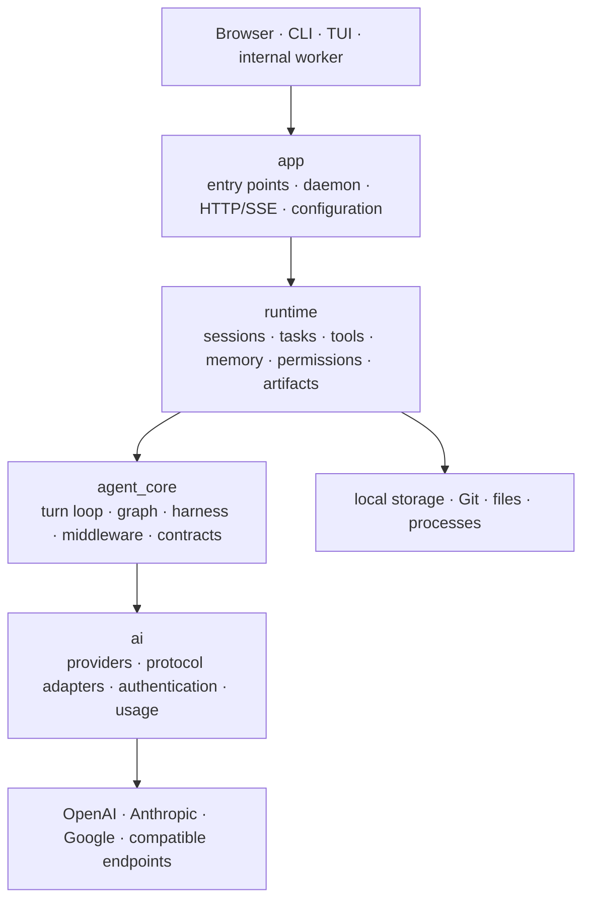
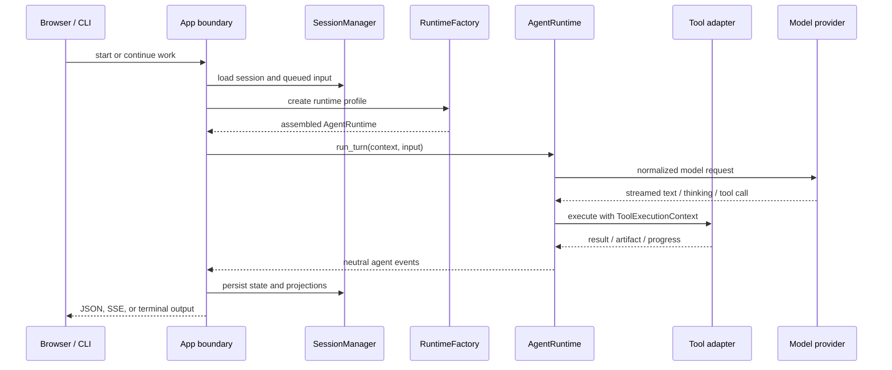

# PWCLI design and architecture

PWCLI is the local runtime behind Personal Workbench. It combines a CLI, TUI,
browser application, daemon, model adapters, durable sessions, and agent tools
in one Rust executable. This document explains why it is shaped this way, how a
request moves through the system, and where new capabilities belong.

## 1. The problem PWCLI is solving

Most AI clients optimize for a single request and response. Productive work has
more demanding requirements:

- a task may outlive the process or browser tab that started it;
- tool calls need workspace identity, permissions, cancellation, and progress;
- follow-up input must reach the correct running or paused session;
- model providers expose different protocols, authentication methods, thinking
  controls, context limits, and tool-call formats;
- generated files, documents, images, and delegated work need durable ownership;
- the terminal, browser, and internal workers must behave consistently.

PWCLI treats these concerns as a runtime problem rather than UI state. The
browser is a projection of durable work; it is not the owner of that work.

## 2. Design goals

1. **Local first.** The daemon, database, workspaces, and embedded web UI run on
   the user's machine. Network calls are limited to configured providers and
   tools that the user allows.
2. **Durable by default.** Sessions, tasks, artifacts, and decisions survive UI
   refreshes and can be resumed or inspected later.
3. **One execution model.** Web, CLI, and internal workers assemble the same
   agent runtime through explicit profiles instead of duplicating setup logic.
4. **Visible control.** Tool activity, progress, permission decisions, model
   usage, and final results are emitted as reviewable events.
5. **Provider independence.** Product behavior depends on stable model
   contracts, not on one vendor's request or streaming format.
6. **Enforced boundaries.** Architecture checks reject new dependencies that
   point from lower layers back into application or storage code.

## 3. System overview



The allowed source dependency direction is:

```text
app  ──►  runtime  ──►  agent_core  ──►  ai
```

Lower layers do not import higher layers. Infrastructure such as SQLite, Git,
the filesystem, HTTP, and external processes is reached through adapters rather
than being pulled into the agent's core contracts.

## 4. Layer responsibilities

### `app`: product shell and composition root

`pwcli/src/app/` owns the ways a user or process enters PWCLI:

- command parsing and CLI/TUI entry points;
- daemon lifecycle and platform integration;
- HTTP routes, SSE mapping, and the embedded browser application;
- configuration loading;
- `RuntimeFactory`, which assembles concrete model, tool, permission, memory,
  artifact, and event adapters for a named runtime profile.

This is the only layer that should know how the whole product is wired together.

### `runtime`: durable work and real-world effects

`pwcli/src/runtime/` owns state and capabilities that persist across model turns:

- sessions, queued input, continuation, and cancellation;
- foreground, background, and delegated tasks;
- tools, permissions, Bash execution, Git, files, and documents;
- memory, settings, artifacts, media, and image/illustration pipelines;
- progress and decision plumbing used by long-running work.

The runtime may invoke the agent core, but the agent core cannot reach back into
session management or the web service.

### `agent_core`: one model/tool turn

`pwcli/src/agent_core/` owns the transport-neutral agent loop:

- stable messages, tool, event, failure, and permission contracts;
- the model/tool graph and middleware pipeline;
- harness policy and hooks;
- reliability decisions and the final event stream.

An `AgentRuntime` owns exactly one turn. It does not write HTTP responses or
persist a session directly. Those responsibilities remain with its caller.

### `ai`: model access

`pwcli/src/ai/` normalizes provider differences:

- provider catalog and model capability metadata;
- OAuth, device login, and API configuration paths;
- OpenAI-, Anthropic-, and Google-style protocol adapters;
- streaming events, thinking controls, tool calls, vision, token usage, and
  fallback behavior.

This layer knows nothing about Personal Workbench sessions, tasks, or routes.

## 5. Runtime ownership

Four objects have deliberately different lifetimes:

| Owner | Lifetime | Responsibility |
| --- | --- | --- |
| `RuntimeFactory` | Application | Builds a runtime from a profile and concrete adapters. |
| `AgentRuntime` | One turn | Runs one model/tool loop and emits neutral events. |
| `SessionManager` | Cross-turn | Owns queued input, pause/resume state, follow-ups, and durable conversation state. |
| `TaskBroker` | Cross-process | Owns delegated and background work, progress, recovery, and completion. |

Keeping these owners separate prevents a common failure mode: an agent turn
silently becoming responsible for HTTP state, database state, and background
processes at the same time.

## 6. Request lifecycle



`ToolExecutionContext` carries explicit identity such as session, work item,
workspace, model, cancellation, and artifact access. Tools should not recover
request identity from global or task-local state.

## 7. Events and frontend state

The daemon exposes HTTP for commands and SSE for ordered progress. Transport
code maps internal events to stable frontend projections. The React client can
therefore render model output, reasoning segments, tool operations, permission
requests, artifacts, and completion without importing Rust domain structures.

The production React build is generated first and embedded into the Rust
binary. `pwcli web` can then serve the UI and API from the same loopback daemon,
which removes a separate production web-server dependency.

## 8. Permissions and local security

PWCLI is capable of editing files and executing commands, so permission is part
of the runtime contract rather than a UI decoration.

- The selected workspace is carried into every tool invocation.
- Tools declare impact and pass through the configured permission policy.
- Consequential operations can pause for an explicit decision.
- OAuth tokens stay in the daemon-side configuration path and are not returned
  to the browser application.
- The daemon listens on loopback by default.
- Capability snapshots used by architecture tests are intentionally secret-free.

Local first does not mean offline: configured model providers and approved tools
can use the network. It means the user controls the runtime, workspace, and
durable state that coordinate those calls.

## 9. Reliability model

Long-running agent work must handle more than happy-path chat streaming. PWCLI
models progress, cancellation, pause/continue decisions, retries, follow-up
input, background ownership, and artifact production explicitly. Session state
and task state are separate because a conversation can own several pieces of
work with different lifecycles.

Structural changes follow a compatibility rule: establish contracts, adapt the
existing implementation, switch one entry point, verify it, and then remove the
old path. Durable state is not dual-written during architecture migrations.

## 10. Extension points

New functionality should enter at the narrowest suitable boundary:

| Capability | Preferred home |
| --- | --- |
| New model or protocol | `ai/provider` or `ai/llm` adapter |
| New stable message/tool/event type | `agent_core/contracts` |
| Agent-loop or harness behavior | `agent_core` |
| Tool with filesystem/process/network effects | `runtime/tools` plus an adapter |
| Durable session, task, memory, or artifact behavior | `runtime` |
| CLI command, route, or UI projection | `app` |
| Frontend domain experience | `src/domain` or `src/features` |

Skills provide behavior-level guidance, while Rust pipelines are used when a
workflow needs deterministic orchestration, retries, rollback, or artifact
semantics. Scientific illustration is one example: routing can be skill-driven,
but rendering and critique live in a typed runtime pipeline.

## 11. Architecture guardrails

Run the architecture check before submitting structural changes:

```bash
npm run check:architecture
```

The check enforces the four-layer dependency direction, keeps contracts free of
web/database/filesystem dependencies, validates secret-free runtime capability
baselines, and treats existing exceptions as a ratchet: exceptions may be
removed, but expanding them requires an explicit architecture decision.

For a complete local verification pass:

```bash
npm run check:architecture
npm test
npm run build
cargo fmt --manifest-path pwcli/Cargo.toml -- --check
cargo test --manifest-path pwcli/Cargo.toml
```

## 12. Repository map

| Path | Responsibility |
| --- | --- |
| `pwcli/src/app/` | Entry points, daemon, composition, configuration, HTTP/SSE. |
| `pwcli/src/runtime/` | Sessions, tasks, tools, permissions, memory, artifacts. |
| `pwcli/src/agent_core/` | Contracts, agent graph, harness, middleware, reliability. |
| `pwcli/src/ai/` | Provider definitions, authentication, protocol adapters, usage. |
| `src/domain/` | Frontend product domains. |
| `src/features/` | Cross-domain frontend workflows. |
| `src/shell/` | Application chrome and presentation primitives. |
| `config/` | Build, test, style, and architecture rules. |
| `scripts/` | Build, packaging, and architecture automation. |

The intended mental model is simple: **the app assembles, the runtime remembers
and acts, the agent core reasons, and the AI layer speaks to models.**
